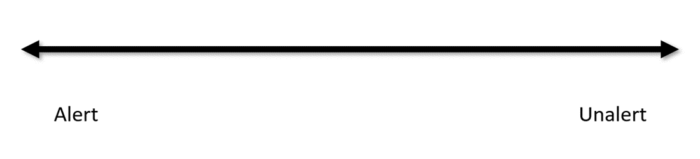

# Identifying Alertness \[Activity]

### Overview&#x20;

In this activity, you’ll work on identifying characteristics related to the state of **alertness** and its opposite, which we'll call **unalertness**.

## 1. Think&#x20;

<figure><figcaption></figcaption></figure>

#### On your own, consider: &#x20;

* <mark style="color:purple;">How do we recognize</mark> <mark style="color:purple;"></mark><mark style="color:purple;">**alertness**</mark> <mark style="color:purple;"></mark><mark style="color:purple;">in ourselves and others?</mark>&#x20;
* <mark style="color:purple;">What cues or characteristics indicate that a person is</mark> <mark style="color:purple;"></mark><mark style="color:purple;">**unalert**</mark><mark style="color:purple;">?</mark>

## 2. Pair

<figure><figcaption></figcaption></figure>

#### With a partner, discuss:

* <mark style="color:purple;">The characteristics you came up with.</mark>
* <mark style="color:purple;">Where each characteristic fits on the range of alert to unalert.</mark>

## 3. Share

<figure><figcaption></figcaption></figure>

#### Share your range of characteristics [<mark style="color:blue;background-color:blue;">**here**</mark>](https://jamboard.google.com/d/1CPkX6OPLH\_oFw2nFVqvJ21QUu1Vuk1l9SvmdUHd26xA/edit?usp=sharing).&#x20;

## 4. Pair

<figure><figcaption></figcaption></figure>

#### With your partner, consider:

* <mark style="color:purple;">How would you train a machine learning model to detect these characteristics?</mark>

