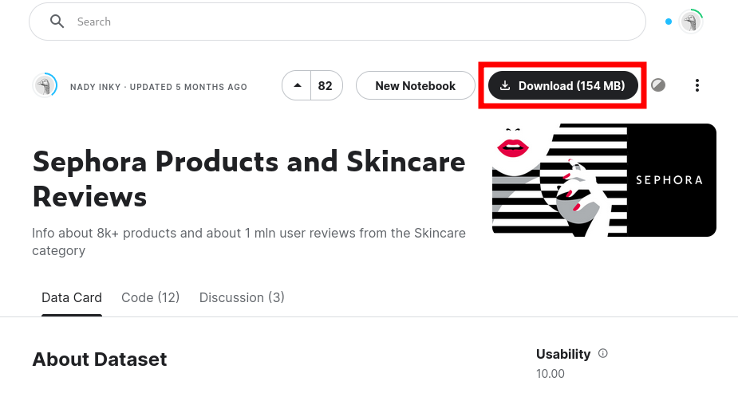

# Data

This activity will use real product and customer review data obtained from the Sephora Skincare product catalog. The data is made available on Kaggle by Nady Inky.

The dataset comprises two main components:

1. Product Information
2. Customer Reviews

To download the dataset:&#x20;

1. Visit [dataset page in Kaggle via this link](https://www.kaggle.com/datasets/nadyinky/sephora-products-and-skincare-reviews/data?select=product_info.csv).&#x20;
2. Select the Download button on the top right of the page.

<figure><figcaption>
Download button on Kaggle's dataset page
</figcaption></figure>

3. Extract the contents of the downloaded zip and locate the **csv files**.

## Dataset Description

### **Product Information in product\_info.csv file**

**product\_id**: The unique identifier for each product.

**product\_name**: The name of the product.

**brand\_id:** The unique identifier for each brand.

**brand\_name:** The name of the brand.

**loves\_count**: The number of "loves" each product has received from users.

**rating**: The average rating for the product.

**reviews:** The number of reviews the product has.

**size**: The size of the product in oz/ml.

**variation** _\__ **type**: The type of variation, if any, for the product.

**variation\_value**: The value of the variation, if any, for the product.

**variation\_desc**: The description of the variation, if any, for the product.

**ingredients**: The ingredients of the product.

**price\_usd**: The price of the product in USD.

**value\_price\_usd**: The value price of the product in USD.

**sale\_price\_usd**: The sale price of the product in USD.

**limited\_edition**: Boolean value indicating whether the product is a limited edition.

**new**: Boolean value indicating whether the product is new.

**online\_only**: Boolean value indicating whether the product is available online only.

**out\_of\_stock:** Boolean value indicating whether the product is out of stock.

**sephora\_exclusive:** Boolean value indicating whether the product is exclusive to Sephora.

**highlights**: The highlights of the product.

**primary\_category**: The primary category of the product.

**secondary\_category**: The secondary category of the product.

**tertiary\_category**: The tertiary category of the product.

**child\_count**: The number of child products, if any.

**child\_max\_price**: The maximum price among child products, if any.

**child\_min\_price**: The minimum price among child products, if any.

In this project will mainly use \_ **product\_id** \_, \_ **product\_name** \_, \_ **ingredients** \_, and \_ **highlights** \_.

### **Customer Reviews in reviews\_0\_250.csv to reviews\_1500\_end.csv files**

**author\_id**: Unique identifier for each author(user).

**rating**: The rating given by the user for that product.

**is\_recommended**: Boolean value indicating whether the user would recommend the product.

**helpfulness**: Indicator of how helpful other users found the review.

**total\_feedback\_count**: The total feedback count for the review.

**total\_neg\_feedback\_count**: The total count of negative feedback for the review.

**total\_pos\_feedback\_count**: The total count of positive feedback for the review.

**submission\_time**: The date the review was submitted.

**review\_text**: The text of the review.

**review\_title**: The title of the review.

**skin\_tone:** The skin tone of the user.

**eye\_color:** The eye color of the user.

**skin\_type**: The skin type of the user.

**hair\_color**: The hair color of the user.

**product\_id**: Unique identifier for each product.

**product\_name**: The name of the product.

**brand\_name**: The name of the brand.

**price\_usd**: The price of the product in USD when the review was written.
