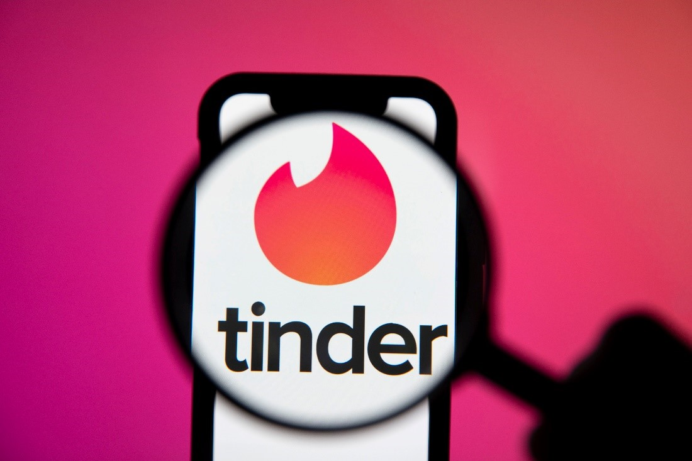
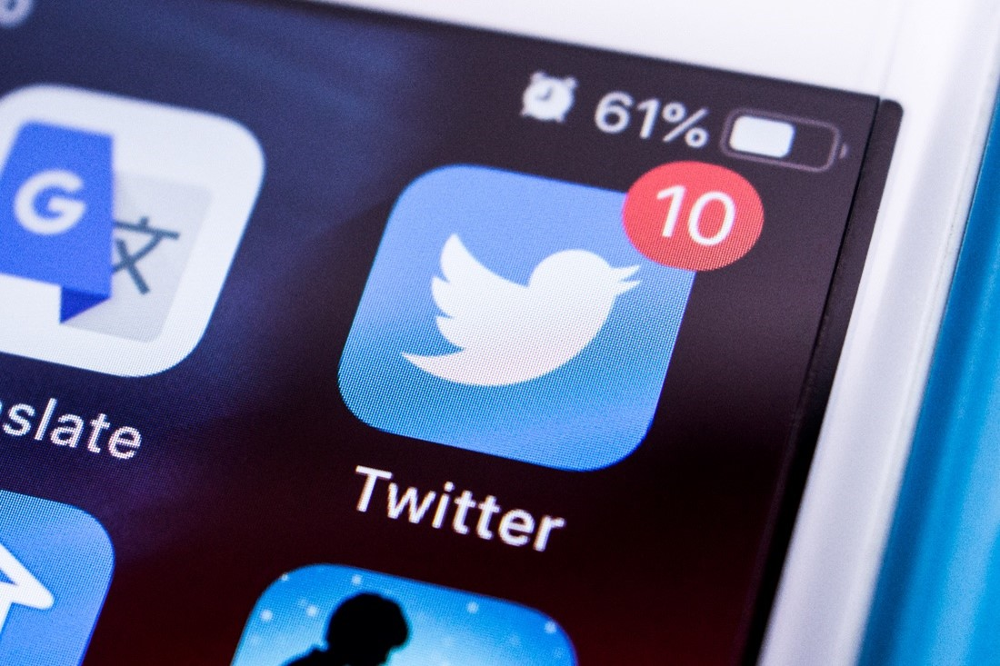

# Issues with Recommender Systems

Recommender systems, while highly beneficial in numerous applications, also come with a range of challenges and potential issues such as:

### Lack of Privacy

* Recommender systems collect and analyze user data for personalized suggestions, posing significant data privacy concerns \[[2](https://papers.ssrn.com/sol3/papers.cfm?abstract_id=3493202)], \[[36](https://www.sciencedirect.com/science/article/pii/S0020025518308493)], \[[37](https://www.mdpi.com/2076-3417/13/10/6201)].
* These systems may unintentionally disclose sensitive user information without adequate controls and regulations \[[36](https://www.sciencedirect.com/science/article/pii/S0020025518308493)], \[[37](https://www.mdpi.com/2076-3417/13/10/6201)].

**Example** : Tinder illustrates such privacy issues with its heavy reliance on user data for match suggestions \[[38](https://checkmarx.com/in-the-news/vulnerabilities-let-people-see-tinder-swipes-photos/)]. A 2018 Kaspersky Lab study revealed potential for attackers to access user profile information, chat history, and activity due to weak data security on dating apps like Tinder \[[39](https://www.dua.com/dating-app-algorithm/)], \[[40](https://www.technologyreview.com/2016/07/15/158803/how-tinder-feedback-loop-forces-men-and-women-into-extreme-strategies/)], \[[41](https://www.independent.co.uk/tech/tinder-bumble-happn-dating-apps-who-has-viewed-my-profile-matches-messages-location-okcupid-badoo-mamba-zoosk-wechat-paktor-a8019251.html)].&#x20;

<figure><figcaption></figcaption></figure>

### Over-personalization

* Filter bubbles, caused by over-personalization in recommender systems, isolate users from diverse information, confining them to their existing preferences or beliefs \[[2](https://papers.ssrn.com/sol3/papers.cfm?abstract_id=3493202)], \[[42](https://dorukkilitcioglu.github.io/2018/10/09/recommender-filter-serendipity.html)]-\[[43](https://www.unite.ai/how-facebooks-ai-spreads-misinformation-and-threatens-democracy/)].
* Recommender systems, especially on social media and news sites, create filter bubbles by consistently showing users content aligning with their preferences, thereby reinforcing bias \[[2](https://papers.ssrn.com/sol3/papers.cfm?abstract_id=3493202)], \[[42](https://dorukkilitcioglu.github.io/2018/10/09/recommender-filter-serendipity.html)]-\[[43](https://www.unite.ai/how-facebooks-ai-spreads-misinformation-and-threatens-democracy/)].

**Example:** Facebook's news feed algorithm exemplifies this, as it personalizes feeds based on past interactions and 'likes', leading to echo chambers that reinforce existing beliefs and limit exposure to diverse viewpoints \[[2](https://papers.ssrn.com/sol3/papers.cfm?abstract_id=3493202)], \[[42](https://dorukkilitcioglu.github.io/2018/10/09/recommender-filter-serendipity.html)]-\[[43](https://www.unite.ai/how-facebooks-ai-spreads-misinformation-and-threatens-democracy/)].&#x20;

<figure><figcaption></figcaption></figure>

### Information Pollution

* Information pollution, stemming from misleading or false content, is exacerbated by recommender systems that prioritize engaging yet potentially inaccurate content \[[45](https://www.brookings.edu/articles/how-misinformation-spreads-on-twitter/)]- \[[46](https://news.mit.edu/2018/study-twitter-false-news-travels-faster-true-stories-0308)].

**Example** : Twitter's recommender system, based on user interactions and preferences, can propagate sensationalism and misinformation \[[46](https://news.mit.edu/2018/study-twitter-false-news-travels-faster-true-stories-0308)] - \[[47](https://link.springer.com/article/10.1007/s43681-021-00107-7)]. False but viral tweets can spread widely due to the algorithm's preference for high-interaction content \[[46](https://news.mit.edu/2018/study-twitter-false-news-travels-faster-true-stories-0308)] - \[[47](https://link.springer.com/article/10.1007/s43681-021-00107-7)]. This process can amplify misleading information, contributing to widespread information pollution \[[46](https://news.mit.edu/2018/study-twitter-false-news-travels-faster-true-stories-0308)] - \[[47](https://link.springer.com/article/10.1007/s43681-021-00107-7)]. &#x20;

<figure><figcaption></figcaption></figure>

### **Bias**

* Recommender systems can unintentionally perpetuate biases and discrimination due to learning from potentially biased data \[[2](https://papers.ssrn.com/sol3/papers.cfm?abstract_id=3493202)], \[[48](https://arxiv.org/abs/1905.01989)], \[[49](https://www.brookings.edu/articles/algorithmic-bias-detection-and-mitigation-best-practices-and-policies-to-reduce-consumer-harms/)].

**Example** : LinkedIn's recommender systems, while designed to match job seekers to relevant positions, were found to harbor biases, with the algorithm factoring in a candidate's likelihood to engage, potentially perpetuating existing job market inequalities by sidelining historically underrepresented groups \[[48](https://arxiv.org/abs/1905.01989)] - \[[49](https://www.brookings.edu/articles/algorithmic-bias-detection-and-mitigation-best-practices-and-policies-to-reduce-consumer-harms/)].&#x20;

<figure><figcaption></figcaption></figure>

#### Lack of Transparency

* Transparency issues in recommender systems arise from unclear decision-making processes in complex machine learning models \[[50](https://muvi-com.medium.com/recommendation-systemthe-importance-of-transparency-in-a-recommendation-system-9c5a943df4c4)], \[[51](https://www.nature.com/articles/s42256-019-0088-2)].
* Users may question recommendation validity due to unclear data usage and prioritization \[[51](https://www.nature.com/articles/s42256-019-0088-2)], \[[52](https://dl.acm.org/doi/10.1145/3411764.3445264)].

**Example** : YouTube's algorithm exemplifies this, with controversial or harmful content recommendations often unexplained  \[[2](https://papers.ssrn.com/sol3/papers.cfm?abstract_id=3493202)], \[[53](https://uxdesign.cc/all-eyes-on-it-increasing-transparency-of-video-recommendations-on-youtube-ca008d68d816)] - \[[54](https://techcrunch.com/2021/07/07/youtubes-recommender-ai-still-a-horrorshow-finds-major-crowdsourced-study/)]. Users might receive extreme content suggestions after watching related videos, with no clear reasoning provided \[[2](https://papers.ssrn.com/sol3/papers.cfm?abstract_id=3493202)], \[[53](https://uxdesign.cc/all-eyes-on-it-increasing-transparency-of-video-recommendations-on-youtube-ca008d68d816)] - \[[54](https://techcrunch.com/2021/07/07/youtubes-recommender-ai-still-a-horrorshow-finds-major-crowdsourced-study/)].&#x20;

<figure><figcaption></figcaption></figure>

#### Addiction

* Recommender systems can lead to over-reliance or addictive behavior due to their engagement-focused design \[[2](https://papers.ssrn.com/sol3/papers.cfm?abstract_id=3493202)], \[[47](https://link.springer.com/article/10.1007/s43681-021-00107-7)], \[[55](https://medium.com/@nrs007/recommender-systems-and-their-impacts-on-autonomy-51a69c64038)].
* These systems suggest content or products closely aligning with user interests, fostering satisfaction or reward feelings, which can lead to habitual use or dependence \[[2](https://papers.ssrn.com/sol3/papers.cfm?abstract_id=3493202)], \[[47](https://link.springer.com/article/10.1007/s43681-021-00107-7)], \[[55](https://medium.com/@nrs007/recommender-systems-and-their-impacts-on-autonomy-51a69c64038)].

**Example**: Instagram's "Explore" feature exemplifies this, leading to habitual, potentially compulsive use, indicative of addictive behavior \[[56](https://www.fastcompany.com/40434598/how-instagram-learns-from-your-likes-to-keep-you-hooked)] - \[[57](https://www.researchgate.net/publication/355055846_Role_of_Instagram_Addiction_on_Academic_Performance_among_Turkish_University_Students_Mediating_Effect_of_Procrastination)].

<figure><figcaption></figcaption></figure>

<strong>Learn More – Issues with Recommender Systems</strong>

**Lack of Privacy**&#x20;

Data privacy is one of the most prominent concerns associated with recommender systems \[[2](https://papers.ssrn.com/sol3/papers.cfm?abstract_id=3493202)], \[[36](https://www.sciencedirect.com/science/article/pii/S0020025518308493)], \[[37](https://www.mdpi.com/2076-3417/13/10/6201)]. These systems gather and analyze large amounts of user data, including user preferences, browsing habits, transaction histories, and more to offer personalized recommendations \[[36](https://www.sciencedirect.com/science/article/pii/S0020025518308493)], \[[37](https://www.mdpi.com/2076-3417/13/10/6201)]. This intensive data collection and processing activity may inadvertently compromise user privacy \[[36](https://www.sciencedirect.com/science/article/pii/S0020025518308493)], \[[37](https://www.mdpi.com/2076-3417/13/10/6201)]. For example, without stringent controls and regulations in place, recommender systems may disclose sensitive information, such as health status from a healthcare app, or purchasing preferences from an e-commerce site \[[36](https://www.sciencedirect.com/science/article/pii/S0020025518308493)], \[[37](https://www.mdpi.com/2076-3417/13/10/6201)].

The popular dating app, **Tinder**, highlights data privacy concerns associated with recommender systems \[[38](https://checkmarx.com/in-the-news/vulnerabilities-let-people-see-tinder-swipes-photos/)]. To make suitable match recommendations, Tinder utilizes an algorithm that relies heavily on user data, including location, age, sex, and personal interests \[[39](https://www.dua.com/dating-app-algorithm/)], \[[40](https://www.technologyreview.com/2016/07/15/158803/how-tinder-feedback-loop-forces-men-and-women-into-extreme-strategies/)]. However, in 2017, a report by Checkmarx, a cybersecurity company, found that Tinder's lack of basic HTTPS encryption for photos allowed any attacker on the same network as the user to observe their activity on the app, including swipes and matches \[[38](https://checkmarx.com/in-the-news/vulnerabilities-let-people-see-tinder-swipes-photos/)].

Further, a study by researchers at the Kaspersky Lab in 2018 demonstrated that due to lax data security on several dating apps, including Tinder, attackers could potentially gain access to users' profile information, their chat history with every member of their groups, and even view which profiles they've viewed and liked \[[41](https://www.independent.co.uk/tech/tinder-bumble-happn-dating-apps-who-has-viewed-my-profile-matches-messages-location-okcupid-badoo-mamba-zoosk-wechat-paktor-a8019251.html)]. These instances illustrate how recommender systems, while offering benefits of personalized user experience, may potentially expose users' private information when adequate security measures are not in place.

**Overpersonalization**&#x20;

Filter bubbles and echo chambers, caused by overpersonalization in recommender systems, present significant issues \[[2](https://papers.ssrn.com/sol3/papers.cfm?abstract_id=3493202)], \[[42](https://dorukkilitcioglu.github.io/2018/10/09/recommender-filter-serendipity.html)]- \[[43](https://www.unite.ai/how-facebooks-ai-spreads-misinformation-and-threatens-democracy/)]. Filter bubbles refer to the phenomenon where users are involuntarily isolated from information that diverges from their existing preferences or beliefs \[[2](https://papers.ssrn.com/sol3/papers.cfm?abstract_id=3493202)], \[[42](https://dorukkilitcioglu.github.io/2018/10/09/recommender-filter-serendipity.html)]. This is often a result of recommender systems that excessively customize a user's online experience based on their browsing history, user profile, or past behavior \[[2](https://papers.ssrn.com/sol3/papers.cfm?abstract_id=3493202)], \[[42](https://dorukkilitcioglu.github.io/2018/10/09/recommender-filter-serendipity.html)]. Echo chambers describe an environment where an individual's beliefs are amplified or reinforced by repetitive exposure to similar viewpoints, with limited exposure to contrasting perspectives \[[44](https://arxiv.org/abs/2307.01221)].

Recommender systems, particularly those used by social media platforms and news aggregation sites, can exacerbate the creation of these filter bubbles and echo chambers through overpersonalization \[[2](https://papers.ssrn.com/sol3/papers.cfm?abstract_id=3493202)], \[[44](https://arxiv.org/abs/2307.01221)]- \[[43](https://www.unite.ai/how-facebooks-ai-spreads-misinformation-and-threatens-democracy/)]. They do this by continually recommending users content that aligns closely with their existing preferences, interests, and beliefs, while filtering out information that contradicts these views \[[2](https://papers.ssrn.com/sol3/papers.cfm?abstract_id=3493202)], \[[44](https://arxiv.org/abs/2307.01221)]- \[[43](https://www.unite.ai/how-facebooks-ai-spreads-misinformation-and-threatens-democracy/)]. The consequence of this overpersonalization is a limited perspective that hampers the discovery of diverse content and reinforces bias \[[2](https://papers.ssrn.com/sol3/papers.cfm?abstract_id=3493202)], \[[44](https://arxiv.org/abs/2307.01221)]- \[[43](https://www.unite.ai/how-facebooks-ai-spreads-misinformation-and-threatens-democracy/)].

During the 2016 U.S. Presidential election, Facebook's recommender system played a role in creating filter bubbles and echo chambers \[[43](https://www.unite.ai/how-facebooks-ai-spreads-misinformation-and-threatens-democracy/)]. Users were shown content that aligned with their political beliefs, often leading to one-sided information feeds \[[43](https://www.unite.ai/how-facebooks-ai-spreads-misinformation-and-threatens-democracy/)]. The platform's recommendation system amplified partisan news sources and conspiracy theories, further polarizing users \[[43](https://www.unite.ai/how-facebooks-ai-spreads-misinformation-and-threatens-democracy/)]. These echo chambers were exacerbated by the viral spread of misinformation, which often went unchecked \[[43](https://www.unite.ai/how-facebooks-ai-spreads-misinformation-and-threatens-democracy/)]. As a result, many users received a skewed perception of the political landscape, making balanced discourse challenging \[[43](https://www.unite.ai/how-facebooks-ai-spreads-misinformation-and-threatens-democracy/)].&#x20;

**Information Pollution**&#x20;

Information Pollution is a broad term used to describe the contamination of the information ecosystem with various forms of misleading, false, or harmful content \[[45](https://www.brookings.edu/articles/how-misinformation-spreads-on-twitter/)]. Recommender systems can inadvertently contribute to information pollution \[[45](https://www.brookings.edu/articles/how-misinformation-spreads-on-twitter/)], \[[58](https://ceur-ws.org/Vol-2758/OHARS-paper3.pdf)]. By prioritizing content that is likely to generate user engagement, these systems often amplify sensational or controversial content, regardless of its accuracy \[[45](https://www.brookings.edu/articles/how-misinformation-spreads-on-twitter/)]- \[[59](https://arxiv.org/abs/2305.06125)]. This can lead to the rapid spread of misinformation (false or misleading information shared without harmful intent) and disinformation (false information shared with the intention to deceive) \[[45](https://www.brookings.edu/articles/how-misinformation-spreads-on-twitter/)]- \[[59](https://arxiv.org/abs/2305.06125)].&#x20;

**Twitter** uses a recommender system to create its "Trending Topics" feature, which shows users popular topics that are currently being discussed by many people on the platform \[[47](https://link.springer.com/article/10.1007/s43681-021-00107-7)]- \[[60](https://www.jstor.org/stable/26480487)]. This system, aiming for relevancy and engagement, can inadvertently prioritize and amplify misinformation \[[47](https://link.springer.com/article/10.1007/s43681-021-00107-7)]- \[[60](https://www.jstor.org/stable/26480487)]. By analyzing user interactions and content virality, the recommender system may favor sensational or controversial topics, which aren't necessarily accurate or verified \[[59](https://arxiv.org/abs/2305.06125)], \[[60](https://www.jstor.org/stable/26480487)], \[[46](https://news.mit.edu/2018/study-twitter-false-news-travels-faster-true-stories-0308)].&#x20;

Additionally, malicious actors, aware of the system's mechanics, can orchestrate coordinated efforts—using bots or synchronized tweeting campaigns—to manipulate the trends and propagate disinformation \[[60](https://www.jstor.org/stable/26480487)], \[46]. As these topics gain visibility, the recommender system further propels them to a wider audience due to their perceived popularity, creating a feedback loop of information pollution \[[60](https://www.jstor.org/stable/26480487)], \[[46](https://news.mit.edu/2018/study-twitter-false-news-travels-faster-true-stories-0308)].&#x20;

**Bias**&#x20;

Recommender systems can perpetuate or even exacerbate existing biases and discrimination, leading to unfair outcomes \[[2](https://papers.ssrn.com/sol3/papers.cfm?abstract_id=3493202)], \[[48](https://arxiv.org/abs/1905.01989)], \[[49](https://www.brookings.edu/articles/algorithmic-bias-detection-and-mitigation-best-practices-and-policies-to-reduce-consumer-harms/)]. These systems often rely on historical data to make predictions \[[2](https://papers.ssrn.com/sol3/papers.cfm?abstract_id=3493202)], \[[48](https://arxiv.org/abs/1905.01989)], \[[49](https://www.brookings.edu/articles/algorithmic-bias-detection-and-mitigation-best-practices-and-policies-to-reduce-consumer-harms/)]. If this data contains biases—stemming from historical prejudices or discriminatory practices—the recommender system will internalize and reproduce those biases \[[2](https://papers.ssrn.com/sol3/papers.cfm?abstract_id=3493202)], \[[48](https://arxiv.org/abs/1905.01989)], \[[49](https://www.brookings.edu/articles/algorithmic-bias-detection-and-mitigation-best-practices-and-policies-to-reduce-consumer-harms/)].&#x20;

**LinkedIn's** recommender systems aim to connect job seekers with fitting positions by analyzing their profiles, which include attributes like skills, past experiences, endorsements, and network connections \[[48](https://arxiv.org/abs/1905.01989)]. For job seekers, the platform suggests potential job openings, while for recruiters, it recommends potential candidates for their posted vacancies \[[48](https://arxiv.org/abs/1905.01989)]. However, these recommendations have been shown to contain biases \[[61](https://www.technologyreview.com/2021/06/23/1026825/linkedin-ai-bias-ziprecruiter-monster-artificial-intelligence/)], \[[62](https://venturebeat.com/business/linkedin-says-it-reduced-bias-in-its-connection-suggestion-algorithm)]. A notable concern was the discovery that LinkedIn's job recommendation system didn't solely rank candidates based on qualifications or fit for a role \[[61](https://www.technologyreview.com/2021/06/23/1026825/linkedin-ai-bias-ziprecruiter-monster-artificial-intelligence/)], \[[62](https://venturebeat.com/business/linkedin-says-it-reduced-bias-in-its-connection-suggestion-algorithm)]. Instead, it also factored in how likely a candidate was to apply for a job or respond to a recruiter's outreach \[[61](https://www.technologyreview.com/2021/06/23/1026825/linkedin-ai-bias-ziprecruiter-monster-artificial-intelligence/)], \[[62](https://venturebeat.com/business/linkedin-says-it-reduced-bias-in-its-connection-suggestion-algorithm)].&#x20;

This design, while perhaps aiming to optimize engagement and successful hiring on the platform, inadvertently introduced bias \[[61](https://www.technologyreview.com/2021/06/23/1026825/linkedin-ai-bias-ziprecruiter-monster-artificial-intelligence/)], \[[62](https://venturebeat.com/business/linkedin-says-it-reduced-bias-in-its-connection-suggestion-algorithm)]. If historically underrepresented groups—due to systemic biases in the job market—were less likely to apply or respond, the algorithm would deprioritize recommending them for future opportunities \[[63](https://industrywired.com/linkedin-coughed-out-ai-bias-is-ai-in-recruitment-reliable/)] - \[[64](https://arxiv.org/abs/2111.13576v1)]. Over time, this could sideline these candidates from lucrative job prospects \[[63](https://industrywired.com/linkedin-coughed-out-ai-bias-is-ai-in-recruitment-reliable/)] - \[[64](https://arxiv.org/abs/2111.13576v1)]. Essentially, the algorithm risked reinforcing existing inequalities in the job market, perpetuating a cycle where those already active and successful on the platform would continue to receive more opportunities, while others might be inadvertently overlooked \[[63](https://industrywired.com/linkedin-coughed-out-ai-bias-is-ai-in-recruitment-reliable/)] - \[[64](https://arxiv.org/abs/2111.13576v1)].&#x20;

**Lack of Transparency**&#x20;

Transparency issues in recommender systems revolve around the user's understanding of how the system makes its recommendations \[[50](https://muvi-com.medium.com/recommendation-systemthe-importance-of-transparency-in-a-recommendation-system-9c5a943df4c4)], \[[51](https://www.nature.com/articles/s42256-019-0088-2)]. As machine learning models become more complex, understanding and explaining the logic behind their decisions becomes challenging \[[65](https://dl.acm.org/doi/10.1145/2959100.2959101)] - \[[66](https://srinstitute.utoronto.ca/news/recommendation-systems-transparency)]. This lack of transparency can cause users to question the validity and integrity of the recommendations, as it's unclear what data the system is using to make its recommendations or why it's emphasizing certain data points over others \[[50](https://muvi-com.medium.com/recommendation-systemthe-importance-of-transparency-in-a-recommendation-system-9c5a943df4c4)], \[[51](https://www.nature.com/articles/s42256-019-0088-2)], \[[52](https://dl.acm.org/doi/10.1145/3411764.3445264)].

**YouTube's** recommendation algorithm serves as an example of this. \[[2](https://papers.ssrn.com/sol3/papers.cfm?abstract_id=3493202)], \[[53](https://uxdesign.cc/all-eyes-on-it-increasing-transparency-of-video-recommendations-on-youtube-ca008d68d816)] - \[[54](https://techcrunch.com/2021/07/07/youtubes-recommender-ai-still-a-horrorshow-finds-major-crowdsourced-study/)]. There have been instances where the platform has been criticized for recommending controversial or harmful content, and because the recommendation process is not transparent, it's hard for users to understand why they're seeing these recommendations \[[2](https://papers.ssrn.com/sol3/papers.cfm?abstract_id=3493202)], \[[67](https://ffwd.medium.com/youtubes-deradicalization-argument-is-really-a-fight-about-transparency-fe27af2f3963)], \[[54](https://techcrunch.com/2021/07/07/youtubes-recommender-ai-still-a-horrorshow-finds-major-crowdsourced-study/)]. For instance, a user who watches a few political news videos may suddenly start receiving recommendations for extreme political content, without any clear explanation as to why \[[2](https://papers.ssrn.com/sol3/papers.cfm?abstract_id=3493202)], \[[67](https://ffwd.medium.com/youtubes-deradicalization-argument-is-really-a-fight-about-transparency-fe27af2f3963)], \[[54](https://techcrunch.com/2021/07/07/youtubes-recommender-ai-still-a-horrorshow-finds-major-crowdsourced-study/)].

**Addiction**&#x20;

Over-reliance or addictive behavior are significant concerns associated with recommender systems \[[2](https://papers.ssrn.com/sol3/papers.cfm?abstract_id=3493202)], \[[47](https://link.springer.com/article/10.1007/s43681-021-00107-7)], \[[55](https://medium.com/@nrs007/recommender-systems-and-their-impacts-on-autonomy-51a69c64038)]. The design of these systems often prioritizes engagement, encouraging users to spend more time on a platform, click more links, or view more content \[[2](https://papers.ssrn.com/sol3/papers.cfm?abstract_id=3493202)], \[[47](https://link.springer.com/article/10.1007/s43681-021-00107-7)], \[[55](https://medium.com/@nrs007/recommender-systems-and-their-impacts-on-autonomy-51a69c64038)]. This can result in addictive patterns of behavior, as users may feel compelled to engage with recommended content or products, even when they had no initial intent to do so \[[2](https://papers.ssrn.com/sol3/papers.cfm?abstract_id=3493202)], \[[47](https://link.springer.com/article/10.1007/s43681-021-00107-7)], \[[55](https://medium.com/@nrs007/recommender-systems-and-their-impacts-on-autonomy-51a69c64038)].

**Instagram's** "Explore" feature uses a recommender system that curates content from across the platform that aligns with a user's past behavior, such as likes, shares, and follows \[[56](https://www.fastcompany.com/40434598/how-instagram-learns-from-your-likes-to-keep-you-hooked)]. This personalized content can be highly engaging, leading users to spend considerable time scrolling through the app \[[56](https://www.fastcompany.com/40434598/how-instagram-learns-from-your-likes-to-keep-you-hooked)], \[[68](https://www.researchgate.net/publication/332210231_Instagram_Friend_or_foe_The_application's_association_with_psychological_well-being)] - \[[57](https://www.researchgate.net/publication/355055846_Role_of_Instagram_Addiction_on_Academic_Performance_among_Turkish_University_Students_Mediating_Effect_of_Procrastination)]. The drive to incessantly check for updates or fresh recommendations can escalate into behavior that resembles addiction \[[69](https://time.com/6127981/addictive-algorithms-2022-facebook-instagram/)] - \[[57](https://www.researchgate.net/publication/355055846_Role_of_Instagram_Addiction_on_Academic_Performance_among_Turkish_University_Students_Mediating_Effect_of_Procrastination)]. Over time, this compulsive behavior can lead to sleep disturbances, decreased productivity, and even social isolation as users prioritize virtual interactions over real-world relationships \[[68](https://www.researchgate.net/publication/332210231_Instagram_Friend_or_foe_The_application's_association_with_psychological_well-being)] - \[[57](https://www.researchgate.net/publication/355055846_Role_of_Instagram_Addiction_on_Academic_Performance_among_Turkish_University_Students_Mediating_Effect_of_Procrastination)].

