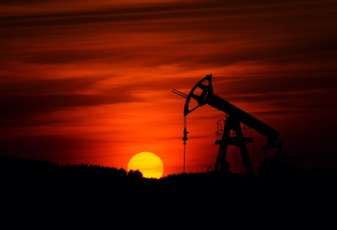

# ML in Energy

## Issues in the Energy Sector 

The energy sector refers to the industry and infrastructure involved in the production, distribution, and consumption of energy resources \[[2](https://www.sciencedirect.com/science/article/abs/pii/S0959652621000548)], \[[3](https://www.worldbank.org/en/topic/energy/overview)]. It is the backbone of industrial and economic development, powering manufacturing, transportation, and infrastructure \[[2](https://www.sciencedirect.com/science/article/abs/pii/S0959652621000548)], \[[4](https://www.investopedia.com/terms/e/energy_sector.asp)]. Without energy, essential aspects of life such as heating, cooling, lighting, and communication would be significantly hindered, affecting the well-being of billions worldwide \[[5](https://www.sciencedirect.com/science/article/pii/S0959378020307512)].

However, there are many issues facing the energy sector \[[6](https://www.ey.com/en_ca/power-utilities/why-artificial-intelligence-is-a-game-changer-for-renewable-energy)].

* Climate change and carbon emissions \[[7](https://www.sciencedirect.com/science/article/pii/S0306261921001409)]
* Strained energy infrastructure \[[8](https://www.researchgate.net/publication/370580741_AI-Enabled_Energy_Policy_for_a_Sustainable_Future)]
* Exhaustibility of traditional energy sources \[[9](https://pixelplex.io/blog/ai-energy-industry/)]
* Lack of energy security \[[10](https://www.sciencedirect.com/science/article/pii/S2405959523000644)]

<figure><figcaption></figcaption></figure>

<strong>Learn More – Issues in the Energy Sector</strong>

* &#x20;**Climate change and carbon emissions:** Climate change is a significant global challenge, and the energy sector plays a crucial role in contributing to greenhouse gas emissions \[[7](https://www.sciencedirect.com/science/article/pii/S0306261921001409)], \[[11](https://viejournal.springeropen.com/articles/10.1186/s40327-018-0064-7)]. The burning of fossil fuels, which currently accounts for about 80% of the world's energy production, releases carbon dioxide (CO2) and other pollutants into the atmosphere, leading to global warming and environmental degradation \[[12](https://www.clientearth.org/latest/latest-updates/stories/fossil-fuels-and-climate-change-the-facts/)], \[[13](https://www.sciencedirect.com/science/article/pii/S2666546822000441)].
* **Strained energy infrastructure:** Energy consumption worldwide is increasing rapidly, driven by industrial and technological development, as well as population growth \[8]. This rising demand places considerable strain on existing energy systems, which are often outdated and challenging to upgrade due to their complex nature \[[6](https://www.ey.com/en_ca/power-utilities/why-artificial-intelligence-is-a-game-changer-for-renewable-energy)], \[[8](https://www.researchgate.net/publication/370580741_AI-Enabled_Energy_Policy_for_a_Sustainable_Future)], \[[11](https://viejournal.springeropen.com/articles/10.1186/s40327-018-0064-7)].
* **Exhaustibility of traditional energy sources:** Traditional energy sources, such as fossil fuels (coal, oil, and natural gas), are finite resources and face the challenge of depletion \[[8](https://www.researchgate.net/publication/370580741_AI-Enabled_Energy_Policy_for_a_Sustainable_Future)], \[[9](https://pixelplex.io/blog/ai-energy-industry/)], \[[14](https://www.sciencedirect.com/science/article/pii/S2211467X22002115)]. As these resources become scarcer and more difficult to extract, there is a need to shift towards renewable and sustainable energy sources to meet growing energy demands while minimizing environmental impacts \[[8](https://www.researchgate.net/publication/370580741_AI-Enabled_Energy_Policy_for_a_Sustainable_Future)], \[[9](https://pixelplex.io/blog/ai-energy-industry/)], \[[15](https://www.energyportal.eu/news/intelligent-power-the-ai-approach-to-energy-management/3521/)].
* **Lack of energy security:** Energy security refers to ensuring a reliable and affordable supply of energy resources to meet consumer demands \[[10](https://www.sciencedirect.com/science/article/pii/S2405959523000644)], \[[16](https://www.sciencedirect.com/science/article/pii/S0360544214007725)]. Disruptions, risks, and attacks on energy infrastructure can have significant economic and social consequences \[[10](https://www.sciencedirect.com/science/article/pii/S2405959523000644)], \[[17](https://www.forbes.com/sites/arielcohen/2023/06/29/the-promise-and-peril-of-ai-in-energy/)], \[[18](https://www.technologyreview.com/2021/01/21/1016460/transforming-the-energy-industry-with-ai/)]. Ensuring energy security requires resilient energy systems that can withstand disruptions and reduce dependence on vulnerable energy sources or supply routes \[[10](https://www.sciencedirect.com/science/article/pii/S2405959523000644)], \[[16](https://www.sciencedirect.com/science/article/pii/S0360544214007725)].

