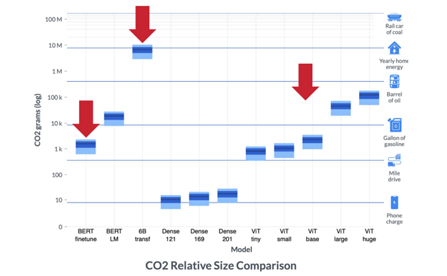
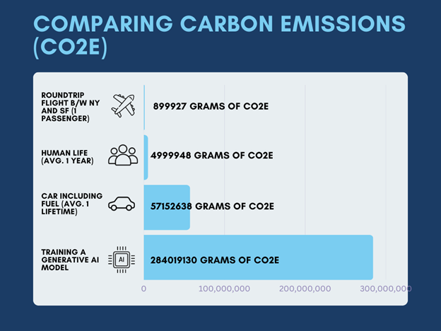

# Challenges with Integrating ML in Energy

While the integration of ML in the energy sector has the potential to address some of the sector’s existing challenges, it can also give rise to new concerns, especially those related to sustainability and privacy.

## Privacy 

<figure><figcaption></figcaption></figure>

The integration of ML in energy systems introduces **privacy** issues that need to be addressed. Here are some key privacy concerns:

* Data collection, storage, and usage \[[10](https://www.sciencedirect.com/science/article/pii/S2405959523000644)], \[[28](https://dl.acm.org/doi/10.1145/3538637.3539636)]
* Lack of user consent and control \[[26](https://www.energyrev.org.uk/media/1985/energyrev_aiandethics_final_202207.pdf)], \[[29](https://www.sciencedirect.com/science/article/abs/pii/S1364032121002616)]
* Profiling and behavioral tracking \[[2](https://www.sciencedirect.com/science/article/abs/pii/S0959652621000548)], \[[28](https://dl.acm.org/doi/10.1145/3538637.3539636)], \[[29](https://www.sciencedirect.com/science/article/abs/pii/S1364032121002616)]
* Data sharing and third-party access \[[26](https://www.energyrev.org.uk/media/1985/energyrev_aiandethics_final_202207.pdf)], \[[28](https://dl.acm.org/doi/10.1145/3538637.3539636)], \[[29](https://www.sciencedirect.com/science/article/abs/pii/S1364032121002616)]
* Data breaches and unauthorized access \[[2](https://www.sciencedirect.com/science/article/abs/pii/S0959652621000548)], \[[10](https://www.sciencedirect.com/science/article/pii/S2405959523000644)], \[[20](https://www.mdpi.com/2673-2688/4/2/22)], \[[22](https://www.frontiersin.org/articles/10.3389/fenrg.2023.1071291/full)], \[[28](https://dl.acm.org/doi/10.1145/3538637.3539636)], \[[29](https://www.sciencedirect.com/science/article/abs/pii/S1364032121002616)]

<strong>Learn More – Privacy Issues Related to ML in Energy</strong>

* **Data Collection, Storage, and Usage:** ML in energy systems rely on collecting vast amounts of data from various sources, such as smart meters, sensors, and consumer behavior \[[28](https://dl.acm.org/doi/10.1145/3538637.3539636)]. This data may include personal and sensitive information about individuals' energy consumption patterns, daily routines, and location \[[10](https://www.sciencedirect.com/science/article/pii/S2405959523000644)]. The privacy challenge lies in how this data is collected, stored, and used, as it can reveal intimate details about individuals or businesses \[[10](https://www.sciencedirect.com/science/article/pii/S2405959523000644)].

- **Lack of User Consent and Control:** ML systems in energy may process personal data without obtaining explicit consent or providing individuals with sufficient control over their data \[[26](https://www.energyrev.org.uk/media/1985/energyrev_aiandethics_final_202207.pdf)], \[[29](https://www.sciencedirect.com/science/article/abs/pii/S1364032121002616)]. Users should have clear visibility into how their data is collected, stored, and utilized, along with the ability to grant or revoke consent for data processing \[[26](https://www.energyrev.org.uk/media/1985/energyrev_aiandethics_final_202207.pdf)].

* **Profiling and Behavioral Tracking:** ML models may analyze energy consumption patterns to create user profiles or track individual behavior \[[28](https://dl.acm.org/doi/10.1145/3538637.3539636)], \[[29](https://www.sciencedirect.com/science/article/abs/pii/S1364032121002616)]. This can lead to privacy concerns, as detailed profiling can reveal personal habits, preferences, and lifestyle patterns, which may be exploited or used for targeted advertising \[[2](https://www.sciencedirect.com/science/article/abs/pii/S0959652621000548)], \[[28](https://dl.acm.org/doi/10.1145/3538637.3539636)].

- **Data Sharing and Third-Party Access:** Energy systems often involve multiple stakeholders, including energy providers, government agencies, and third-party service providers \[[26](https://www.energyrev.org.uk/media/1985/energyrev_aiandethics_final_202207.pdf)]. Privacy risks arise when data is shared with these entities, as there is a potential for unauthorized or improper use of the data beyond its intended purpose \[[28](https://dl.acm.org/doi/10.1145/3538637.3539636)], \[[29](https://www.sciencedirect.com/science/article/abs/pii/S1364032121002616)].

* **Data Breaches and Unauthorized Access:** With the increased connectivity and real-time access to data in ML-driven energy systems, the risk of data breaches and unauthorized access becomes more significant \[[20](https://www.mdpi.com/2673-2688/4/2/22)], \[[22](https://www.frontiersin.org/articles/10.3389/fenrg.2023.1071291/full)], \[[29](https://www.sciencedirect.com/science/article/abs/pii/S1364032121002616)]. Malicious actors or hackers may attempt to gain access to the system, compromising the privacy of individuals and potentially manipulating energy usage data \[[2](https://www.sciencedirect.com/science/article/abs/pii/S0959652621000548)], \[[10](https://www.sciencedirect.com/science/article/pii/S2405959523000644)], \[[28](https://dl.acm.org/doi/10.1145/3538637.3539636)].

&#x20;

### **Example - Smart Homes**

<figure><figcaption></figcaption></figure>

A popular application of AI in Energy is the smart home. A smart home refers to a residence equipped with various internet-connected devices and systems that can be controlled remotely and automate everyday tasks \[[30](https://www.sciencedirect.com/science/article/abs/pii/S2542660522001172)]. These devices, often referred to as Internet of Things (IoT) devices, are designed to enhance convenience, comfort, and energy efficiency within the home \[[30](https://www.sciencedirect.com/science/article/abs/pii/S2542660522001172)].

### **Privacy Issues in Smart Homes**

* Smart home devices, such as cameras, voice assistants, and sensors, collect extensive data about residents' activities, behaviors, and preferences \[[31](https://www.sciencedirect.com/science/article/pii/S0747563223001218)]. This data may include audio recordings, video footage, energy usage patterns, and even personal routines \[[31](https://www.sciencedirect.com/science/article/pii/S0747563223001218)]. The concern arises when this data is stored, accessed, or potentially shared with third parties without the user's knowledge or consent \[[32](https://ieeexplore.ieee.org/document/6406331)].
* Smart home devices often integrate with third-party services or platforms, such as cloud storage, voice recognition services, or data analytics providers \[[33](https://www.researchgate.net/publication/344929727_Towards_Secure_and_Privacy-Preserving_IoT_Enabled_Smart_Home_Architecture_and_Experimental_Study)] - \[[34](https://www.mdpi.com/2078-2489/7/3/44)]. The data collected by these devices may be shared with these third parties, raising privacy concerns regarding who has access to the data, how it is used, and whether it is adequately protected \[[35](https://dl.acm.org/doi/10.1145/3139937.3139948)].
* Smart homes can become targets for hackers seeking to gain unauthorized access to personal data or control over the devices \[[36](https://www.researchgate.net/publication/331133954_Internet_of_Things_IoT_of_Smart_Home_Privacy_and_Security)]. A security breach can result in the exposure of sensitive information, such as live video feeds, access codes, or personal routines, potentially compromising the privacy and safety of residents \[[37](https://arxiv.org/abs/1705.06805)], \[[38](https://www.semanticscholar.org/paper/Security-and-Privacy-Consideration-for-Internet-of-Desai-Upadhyay/dd05e2c2060dd1181bb4de45c09b43c6680173da)].

### **Hacking Incidents**&#x20;

* In a massive smart home privacy breach, a staggering 2 billion records were exposed, compromising sensitive information such as users’ email addresses, names, and precise geolocation \[[39](https://www.forbes.com/sites/daveywinder/2019/07/02/confirmed-2-billion-records-exposed-in-massive-smart-home-device-breach/)]. One of the most concerning types of information that the hackers got hold of was the reset codes for the smart home devices \[[39](https://www.forbes.com/sites/daveywinder/2019/07/02/confirmed-2-billion-records-exposed-in-massive-smart-home-device-breach/)]. With these codes, hackers could change the password and lock users out of their smart homes and devices, holding them for ransom \[[39](https://www.forbes.com/sites/daveywinder/2019/07/02/confirmed-2-billion-records-exposed-in-massive-smart-home-device-breach/)].
* This is not an isolated incident, as there have been countless other smart home hacking incidents reported. To find out more about the likelihood of these incidents, researchers set up a honeypot, which is a system or network with the purpose of attracting and monitoring malicious activities \[[40](https://www.mynewsdesk.com/nccgroup/news/honeypot-research-reveals-the-connected-life-might-not-be-so-sweet-430634)]. In just one week, 12,807 smart home hacking attempts were detected \[[40](https://www.mynewsdesk.com/nccgroup/news/honeypot-research-reveals-the-connected-life-might-not-be-so-sweet-430634)].

<strong>Learn more – ML and Smart Homes</strong>

ML plays a crucial role in the functioning of a smart home by enabling it to learn and adapt to the preferences and behavior of its occupants \[[41](https://www.smartdatacollective.com/how-machine-learning-is-used-in-smart-home-automation/)]. ML models can optimize energy usage by considering factors such as weather conditions, time of day, and occupant behavior \[[30](https://www.sciencedirect.com/science/article/abs/pii/S2542660522001172)]. For example, a ML-powered smart thermostat can learn the occupants' preferences and adjust temperature settings accordingly to minimize energy consumption while maintaining comfort \[[42](https://www.e3s-conferences.org/articles/e3sconf/abs/2023/24/e3sconf_icseret2023_02002/e3sconf_icseret2023_02002.html)]. Similarly, ML can optimize lighting by automatically adjusting brightness levels or turning off lights in unoccupied areas \[[42](https://www.e3s-conferences.org/articles/e3sconf/abs/2023/24/e3sconf_icseret2023_02002/e3sconf_icseret2023_02002.html)].

***

## Sustainability 

<figure><figcaption></figcaption></figure>

While ML has the potential to optimize energy production, distribution, and consumption, it also comes with certain environmental concerns \[[22](https://www.frontiersin.org/articles/10.3389/fenrg.2023.1071291/full)], \[[26](https://www.energyrev.org.uk/media/1985/energyrev_aiandethics_final_202207.pdf)], \[[43](https://ieeexplore.ieee.org/document/9883030)].

Here are a few key points highlighting the sustainability issues related to ML in the energy sector:

* **Extractivism and Resource Depletion:** The production of ML technologies relies on various minerals and resources, such as lithium and cobalt, which are often extracted through mining in lower-income countries \[[43](https://ieeexplore.ieee.org/document/9883030)]. This extractivism can have detrimental social and environmental impacts, including deforestation, pollution, and displacement of local communities \[[44](https://www.theguardian.com/world/2021/jan/14/carbon-neutrality-is-a-fairy-tale-how-the-race-for-renewables-is-burning-europes-forests)].
* **Opportunity Costs:** The energy invested in training ML models could potentially be utilized for more critical purposes, such as meeting the basic energy needs of underserved communities or supporting other sustainable initiatives \[[43](https://ieeexplore.ieee.org/document/9883030)], \[[45](https://dl.acm.org/doi/10.1145/3442188.3445922)]. Prioritizing the allocation of energy resources becomes crucial to ensure that ML's benefits outweigh its environmental costs \[[43](https://ieeexplore.ieee.org/document/9883030)], \[[45](https://dl.acm.org/doi/10.1145/3442188.3445922)].
* **Application of ML in Fossil Fuel Industry:** ML’s integration in energy has not just been in the renewable energy sector, it is also being used by oil and gas companies \[[9](https://pixelplex.io/blog/ai-energy-industry/)]. Even though ML has the potential to assist oil and gas companies in reducing energy consumption within their processes, the amount of energy saved by ML remains insignificant compared to the substantial environmental impact caused by the fossil fuel industry \[[46](https://ideas.repec.org/a/nat/natcli/v12y2022i6d10.1038_s41558-022-01377-7.html)]. For example, if ML is applied in the oil and gas sector to improve exploration, it helps to increase the amount of oil and gas extracted, which in turn increases carbon emissions \[[46](https://ideas.repec.org/a/nat/natcli/v12y2022i6d10.1038_s41558-022-01377-7.html)].
* **Energy Consumption:** ML models, particularly deep learning models, require significant computational resources during training and operation \[[47](https://futurium.ec.europa.eu/en/european-ai-alliance/blog/sustainable-artificial-intelligence-energy-sector?language=es)]. This translates into high energy consumption, especially when training complex models over extended periods \[[48](https://arxiv.org/abs/2212.11738)]. The energy consumed by ML systems, including the power needed to run GPUs and TPUs, can result in a substantial carbon footprint \[[47](https://futurium.ec.europa.eu/en/european-ai-alliance/blog/sustainable-artificial-intelligence-energy-sector?language=es)], \[[49](https://www.techtarget.com/searchenterpriseai/feature/AI-and-climate-change-The-mixed-impact-of-machine-learning)]. The energy demand for ML training can contribute to increased carbon emissions and strain on existing energy infrastructure \[[48](https://arxiv.org/abs/2212.11738)].

### &#x20;**Example – Sustainability Issues in Smart Homes**

While smart homes offer various benefits, they also pose certain sustainability challenges, such as:

* **Electronic Waste:** Smart home devices often have a relatively short lifespan compared to traditional appliances \[[50](https://www.bitdefender.com/blog/hotforsecurity/smart-household-appliance-might-short-lifespan/)]. As technology advances, newer devices with additional features become available, prompting homeowners to upgrade their existing devices \[[51](https://www.researchgate.net/publication/343436758_Towards_Longevity_of_Smart_Home_Systems)], \[[52](https://nymag.com/intelligencer/smarthome/very-happy-article-about-smart-homes-waste-and-obsolescence.html)]. This leads to an increase in electronic waste, as the discarded devices contribute to landfill pollution and the depletion of natural resources \[[53](https://pirg.org/articles/bricked-house-how-obsolescence-looms-over-our-smart-home-devices/)].
* **Energy Consumption:** While smart homes can optimize energy usage through automation and intelligent control systems, the proliferation of multiple connected devices can lead to increased overall energy consumption \[[54](https://www.ijert.org/the-impact-of-smart-homes-on-energy-consumptions-a-survey)]. Each device, even in standby mode, consumes a certain amount of energy \[[54](https://www.ijert.org/the-impact-of-smart-homes-on-energy-consumptions-a-survey)], \[[55](https://www.the-ambient.com/features/smart-home-energy-use-costs-bills-2778)]. Additionally, the energy required for data transmission and processing in smart homes can contribute to the overall energy footprint \[[54](https://www.ijert.org/the-impact-of-smart-homes-on-energy-consumptions-a-survey)], \[[55](https://www.the-ambient.com/features/smart-home-energy-use-costs-bills-2778)].
* **Manufacturing and Supply Chain:** The production and distribution of smart home devices involve resource-intensive processes \[[56](https://www.sciencedirect.com/science/article/pii/S030142151630711X)]. The extraction of raw materials, energy consumption during manufacturing, transportation, and packaging contribute to carbon emissions and environmental degradation \[[57](https://www.annualreviews.org/doi/10.1146/annurev-environ-021512-110549)]. Additionally, the disposal of hazardous materials used in electronic devices, such as batteries, can pose environmental risks if not handled properly \[[58](https://www.itworldcanada.com/article/e-waste-techs-big-dirty-secret/481142)], \[[59](https://www.zdnet.com/article/our-old-devices-are-creating-a-mountain-of-e-waste-and-its-getting-a-lot-bigger/)].
* **Data Centers and Cloud Services:** Smart homes often rely on cloud-based services and data centers for data storage, processing, and analysis \[[51](https://www.researchgate.net/publication/343436758_Towards_Longevity_of_Smart_Home_Systems)]. These data centers require significant amounts of energy to operate and cool the servers, resulting in carbon emissions and a strain on energy resources \[[60](https://www.datacenterknowledge.com/industry-perspectives/data-center-costs-driving-force-energy-efficiency-part-1)], \[[61](https://www.grcooling.com/blog/the-effects-of-data-centers-on-the-environment/)]. The sustainability of the infrastructure supporting smart home services should be considered \[[60](https://www.datacenterknowledge.com/industry-perspectives/data-center-costs-driving-force-energy-efficiency-part-1)].

### **Examining ML’s Carbon Footprint**

The figure below displays a measure of operational emissions from energy consumed during computation \[[62](https://arxiv.org/abs/2206.05229)]. Embodied emissions from the production and end of life of hardware include mining and production, transportation, and disposal or recycling \[[62](https://arxiv.org/abs/2206.05229)].

<figure><figcaption>
[<a href="https://www.grcooling.com/blog/the-effects-of-data-centers-on-the-environment/">61</a>]
</figcaption></figure>

The amount of carbon emitted during computation depends on the model type and on whether a model is being fine-tuned or trained from scratch \[[62](https://arxiv.org/abs/2206.05229)]. For example: &#x20;

* 6B transf: Emits as much as powering a typical home for a year.
* Fine tuning BERT: Emits as much as consuming less than a liter of gasoline.
* ViT: Size of the model matters.

Understanding the carbon footprint of ML technologies gives us vital insight into the impact we might be having on the environment from our use of seemingly harmless tools such as generative AI. Examine the infographic below to gauge how much carbon is emitted from generative AI and how this compares to the emissions produced by cars, airplanes, and humans.

<figure><figcaption>
[<a href="https://www.researchgate.net/publication/342540121_Energy_and_Policy_Considerations_for_Modern_Deep_Learning_Research">63</a>], [<a href="https://www.technologyreview.com/2019/06/06/239031/training-a-single-ai-model-can-emit-as-much-carbon-as-five-cars-in-their-lifetimes/">64</a>]
</figcaption></figure>

&#x20;As shown in the graphic above, ML technologies have a significant carbon footprint. While generative AI tools such as ChatGPT, DALL-E, and MidJourney have garnered immense attention, it's essential to consider the broader implications of their use. Beyond the advantages they offer, we must critically assess their environmental impact and potential trade-offs, ensuring that our technological advancements do not compromise the health of our planet.

While you might not be directly engaged in the development of expansive ML models like ChatGPT, it is imperative to keep tabs on their carbon emissions. Get in the habit of tracking the emissions of the ML tools you use. Even more important, is to track the emissions of the ML technologies that you are helping to develop. Explore the links below to learn how to track the carbon emissions of ML.

* [http://calculator.green-algorithms.org/](http://calculator.green-algorithms.org/)
* [https://codecarbon.io/](https://codecarbon.io/)
* [https://mlco2.github.io/impact/](https://mlco2.github.io/impact/)
