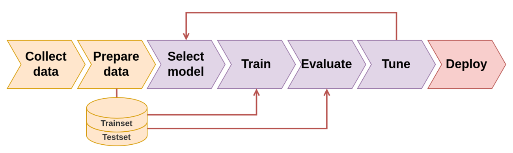

# Neural networks and basic neuron architectures

To model the world around us and process information, our brain uses a large interconnected network of neurons [\[1\]](https://medium.com/technologymadeeasy/for-dummies-the-introduction-to-neural-networks-we-all-need-c50f6012d5eb). A neuron collects inputs from other neurons using dendrites [\[1\]](https://medium.com/technologymadeeasy/for-dummies-the-introduction-to-neural-networks-we-all-need-c50f6012d5eb). A neuron sums all the inputs and if the resulting value is greater than a threshold, it fires [\[1\]](https://medium.com/technologymadeeasy/for-dummies-the-introduction-to-neural-networks-we-all-need-c50f6012d5eb). The fired signal is then sent to other neurons through the axon [\[1\]](https://medium.com/technologymadeeasy/for-dummies-the-introduction-to-neural-networks-we-all-need-c50f6012d5eb).

<figure><figcaption></figcaption></figure>

Artificial neurons have the same basic components as biological neurons [\[1\]](https://medium.com/technologymadeeasy/for-dummies-the-introduction-to-neural-networks-we-all-need-c50f6012d5eb). A neuron takes inputs, does some calculations with them, and produces an output [\[1\]](https://medium.com/technologymadeeasy/for-dummies-the-introduction-to-neural-networks-we-all-need-c50f6012d5eb).

<figure><figcaption></figcaption></figure>

The building blocks of neural networks is neurons [\[1\]](https://medium.com/technologymadeeasy/for-dummies-the-introduction-to-neural-networks-we-all-need-c50f6012d5eb). A neural network is made up of several neurons connected to each other [\[1\]](https://medium.com/technologymadeeasy/for-dummies-the-introduction-to-neural-networks-we-all-need-c50f6012d5eb).

&#x20;This network has 2 inputs, a hidden layer with 2 neurons (h1​ and h2​), and an output layer with 1 neuron (o1​) [\[1\]](https://medium.com/technologymadeeasy/for-dummies-the-introduction-to-neural-networks-we-all-need-c50f6012d5eb). Notice that the inputs for o1​ are the outputs from h1​ and h2​ — that’s what makes this a network [\[1\]](https://medium.com/technologymadeeasy/for-dummies-the-introduction-to-neural-networks-we-all-need-c50f6012d5eb).

A hidden layer is any layer between the input (first) layer and output (last) layer [\[1\]](https://medium.com/technologymadeeasy/for-dummies-the-introduction-to-neural-networks-we-all-need-c50f6012d5eb). There can be multiple hidden layers creating a deep neural network [\[1\]](https://medium.com/technologymadeeasy/for-dummies-the-introduction-to-neural-networks-we-all-need-c50f6012d5eb).For more information, watch this [video](https://www.youtube.com/watch?v=aircAruvnKk\&ab_channel=3Blue1Brown) until timestamp 8:30.

<figure><figcaption></figcaption></figure>

#### [But what is a neural network? | Chapter 1, Deep learning](https://www.youtube.com/watch?v=aircAruvnKk)

<figure><figcaption></figcaption></figure>

## Common steps involved in training a neural network

<figure><figcaption></figcaption></figure>
