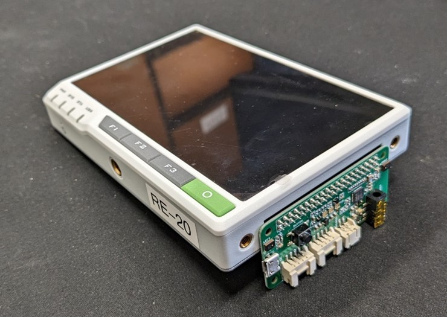
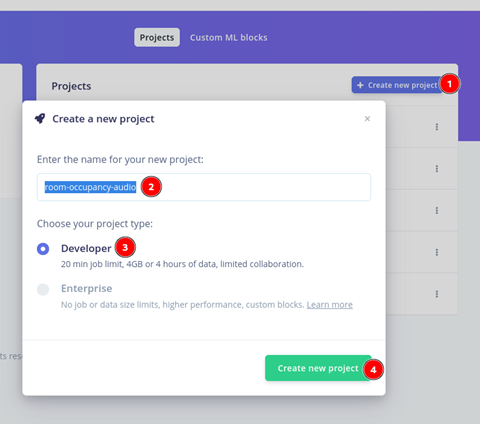
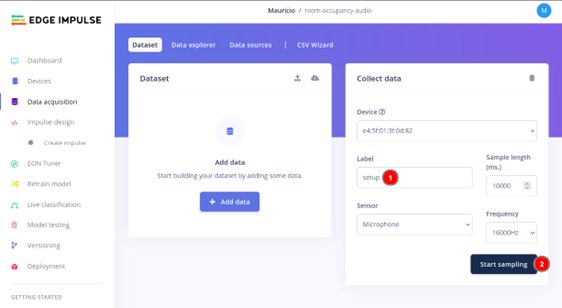
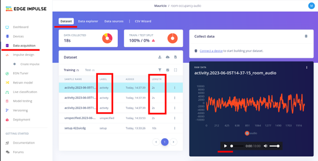

# Part 1: Hardware & Code Setup

## A. Setting up the Microphone

The setup depends on your specific microphone model. Instructions below were taken from the [Wiki page of Seeed's ReSpeaker 2-Mic Pi Hat](https://wiki.seeedstudio.com/ReSpeaker_2_Mics_Pi_HAT_Raspberry):

1.  Make sure the ReSpeacker is connected to the 40-pin header on the side of the Pi:&#x20;

    <figure><figcaption></figcaption></figure>
2.  Download the sound card drivers, install and reboot. Run in your command line:

    ```bash
    git clone https://github.com/Seeed-Projects/seeed-voicecard.git 
    cd seeed-voicecard 
    sudo ./install.sh 
    sudo reboot now
    ```
3.  Install the Python packages to use the microphone in python scripts. Run the cli command:

    ```bash
    git clone https://github.com/respeaker/mic_hat.git
    cd mic_hat
    sudo apt-get install portaudio19-dev libatlas-base-dev -y
    pip3 install -r requirements.txt
    pip3 install opencv-python
    ```
4.  Get the microphone device index number (as seen by Python).

    a. (In this case, the sound device index is 0)

    
    ```bash
    python3 recording_examples/get_device_index.py

    # Output:
    Input Device id  0  -  seeed2micvoicec: bcm2835-i2s-wm8960-hifi wm8960-hifi-0 (hw:0,0)
    ```
    
5.  Before recording sound with Python, open the file `recording_examples/record.py` with a text editor (eg. nano or vi) and change line 8: `RESPEAKER_INDEX = [Number]` to match the index number from the previous step.

    ```bash
    nano recording_examples/record.py
    # Change line 8 to:
    RESPEAKER_INDEX = 0  # refer to input device id
    ```
6.  Verify that you can capture audio with Python by running the script record.py:

    a. A new wav file named **output.wav** should be generated in the current directory

    ```bash
    python3 recording_examples/record.py
    ```

## B. Creating an Edge Impulse Account

The platform [Edge Impulse](https://edgeimpulse.com/) is an online service that simplifies all steps involved in creating, training, validating and deploying a machine learning model that can run on different types of hardware such as laptops, cellphones, Raspberry Pis, Arduinos, etc.

Edge Impulse uses TinyML under the hood. TinyML stands for "Tiny Machine Learning," is a field of AI focused on creating models and models that can run on low-power, low-resource devices such as microcontrollers. It focuses on constraints like power, latency, connectivity, and privacy. Select this[ link](https://www.datacamp.com/blog/what-is-tinyml-tiny-machine-learning) to learn more.

1. Create a free account on[ Edge Impulse](https://www.edgeimpulse.com/).&#x20;
2.  Select **Create new project**, give it a name and choose a project type of **Developer** (free)&#x20;

    <figure><figcaption></figcaption></figure>
3.  Once you are at the project **Dashboard** page, scroll to the bottom right and under Project Info, select **Target Device: Raspberry Pi 4**.&#x20;

    <figure><figcaption></figcaption></figure>
4. Your account is ready to receive data! Next are the tools required for that.

## C. Installing Edge Impulse CLI tools and SDK

Edge Impulse provides their own command line (CLI) tool based on Node.js to upload data and download models. They also provide a Python Software Development Kit (SDK) to easily incorporate their models in Python scripts. (ref: [Edge Impulse CLI: Installation)](https://docs.edgeimpulse.com/docs/edge-impulse-cli/cli-installation)

1.  Install Node.js version 14, Edge Impulse Linux tool, and Edge Impulse CLI:

    ```bash
    bashCopy codecurl -sL https://deb.nodesource.com/setup_14.x | sudo -E bash -
    sudo apt install -y gcc g++ make build-essential nodejs sox gstreamer1.0-tools gstreamer1.0-plugins-good gstreamer1.0-plugins-base gstreamer1.0-plugins-base-apps
    mkdir ~/.npm-global
    npm config set prefix '~/.npm-global'
    echo 'export PATH=~/.npm-global/bin:$PATH' >> ~/.profile
    npm config set user root && sudo npm install edge-impulse-linux -g --unsafe-perm
    npm install -g edge-impulse-cli
    sudo reboot
    ```
2.  Install Edge Impulse Python SDK:

    
    ```bash
    bashCopy codesudo apt-get install libatlas-base-dev libportaudio2 libportaudiocpp0 portaudio19-dev
    pip3 install edge_impulse_linux -i https://pypi.python.org/simple
    edge-impulse-linux --disable-camera
    ```
    
3.  Connect the Edge Impulse CLI tool to your project on the cloud

    a. You will be asked to log in, and choose an Edge Impulse project.

    b. When asked, select the `seeed-2mic-voicecard` microphone.

    c. We are not using a camera in this project so we’ll use _`--disable-camera`_
4. Follow the URL printed to the console and you will be taken to the _**Data acquisition**_ page of your project.
5. Verify that Edge Impulse can connect to your device by uploading a test audio sample to your project:
   1.  Set label field to ‘_setup’_ and then start sampling by selecting the button.&#x20;

       <figure><figcaption></figcaption></figure>
6. Once you can verify that the Edge Impulse CLI is running and connected to the cloud, you can stop it with _**Ctrl + C**_.

## D. Downloading the project’s repository from GitHub

1.  Choose a directory on your file system and run:&#x20;

    <pre class="language-bash"><code class="lang-bash">git clone https://github.com/John-Abbott-College/pia-ai-kits-2022.git
    <strong>cd pia-ai-kits-2022/room-occupancy-audio
    </strong></code></pre>
2. Check the contents of the folder. Inside this folder you will find 3 files:
   1. `get-samples-and-upload.py`: Main script for data collection.
   2. `get-one-sample.py`: Script to record a single audio sample.
   3. `run-inference.py`: Script to run the model locally.
   4. `apa102.py` and `pixels.py`: Scripts for controlling the RGB lights on the reSpeaker.
3. Collect a single audio sample using the script `git_one_sample.py`
   1.  The script should record 2 seconds of audio and store in the `samples/` folder.

       ```bash
       python3 get-one-sample.py
       ```
4. Run the edge-impulse-uploader CLI command to connect it to your project and upload the audio sample to Edge Impulse.
   1. The argument _samples/\*_ tells the command to upload all files inside the _samples_ folder.
   2.  To avoid data duplication, Edge-Impulse CLI will not re-upload files that have already been uploaded. They will show as “Failed toupload ” and no action is required.

       <pre class="language-bash"><code class="lang-bash"><strong>git clone https://github.com/John-Abbott-College/pia-ai-kits-2022.git
       </strong><strong>cd pia-ai-kits-2022/room-occupancy-audio
       </strong></code></pre>


Recording and uploading one sample at a time is too slow. The Python script `get-samples-and-upload.py` can record and upload many files at once.


5.  Learn how to use the file `get-samples-and-upload.py` by running it in help mode. You will see:

    
    ```bash
    python3 get-samples-and-upload.py -h

    usage: get-samples-and-upload.py [-h] [-e] [-a] [-n NUMBER_SAMPLES] [-s SLEEP] [-l LENGTH] [-f FILENAME] [-d DIRECTORY] [-p]
     
    optional arguments:
      -h, --help            show this help message and exit
      -e, --empty           add 'empty' label to sample
      -a, --activity        add 'activity' label to sample
      -n NUMBER_SAMPLES, --number_samples NUMBER_SAMPLES
                            Number of samples to take in a row, defaults to 100
      -s SLEEP, --sleep SLEEP
                            time internal between samples in seconds, defaults to 5
      -l LENGTH, --length LENGTH
                            total sample time length in seconds, defaults to 2
      -f FILENAME, --filename FILENAME
                            base filename for audio file, defaults to room_audio
      -d DIRECTORY, --directory DIRECTORY
                            directory to store csv files. defaults to samples/
      -p, --pixels          Whether to use pixel lights while running.

    ```
    
6. Collect 3 samples of 2 seconds each that are 5 seconds apart with the label “activity”:
   1.  The script will automatically upload the audio sample to Edge Impulse.&#x20;

       ```bash
       python3 get-samples-and-upload.py -n 3 -l 2 -s 5 -a
       ```
7. Before moving on to collect large amounts of data, verify that the samples collected in the previous step are valid and available in Edge Impulse. Do the following:
   1. In your Edge Impulse project, go to the _**Data acquisition**_ page and select the _**Dataset**_ tab.
   2. &#x20;Check that the uploaded samples are indeed 2 seconds long and play the sample to verify it corresponds with the noises in the room.
   3.  Check that the label of the last 3 uploaded samples is _**activity**._ &#x20;

       &#x20;&#x20;

       <figure><figcaption></figcaption></figure>
8. Clean the dataset by deleting any samples with labels that are not “_**activity**_” or “_**empty**_”.
   1. Select the 3 dots beside the sample to be disabled and hit on _**delete**_.
9.  Congrats! You can now collect, label and upload your data to your project!

