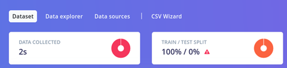
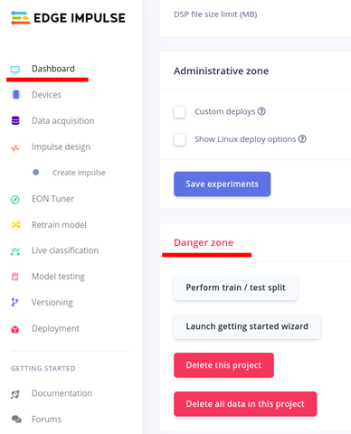
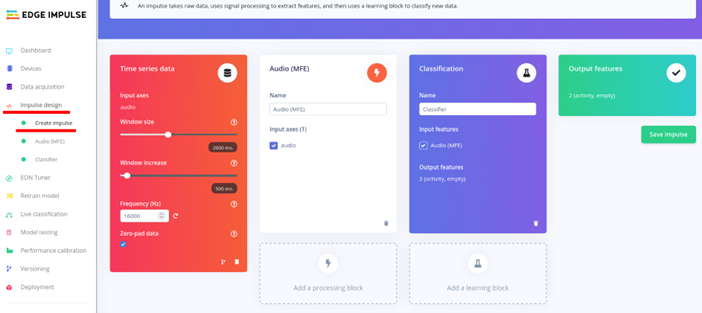
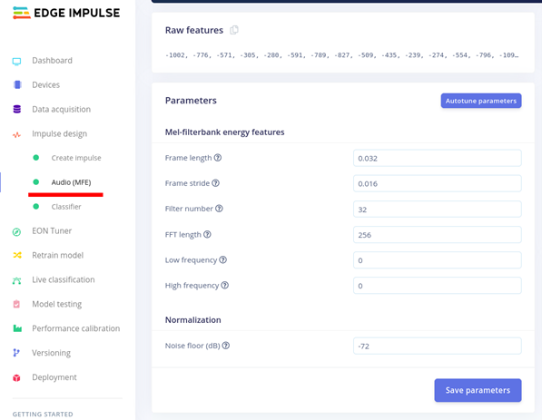
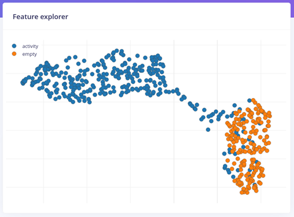
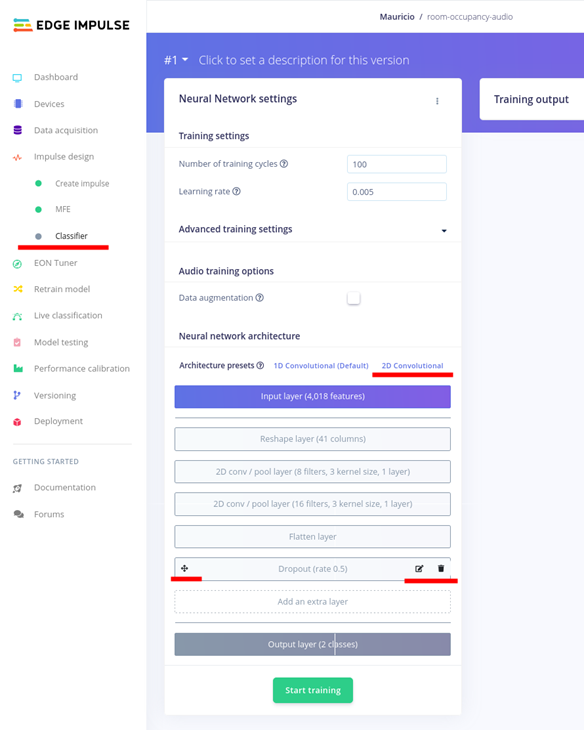

# Part 2: Data Collection, Training & Testing

In this part, you will collect audio samples, add labels to each sample, upload them to Edge Impulse, and use them to train your model. The accuracy of an ML model strongly depends on the diversity of data used to train it.

## A. Data Collection

Use the Python script you cloned in the previous part to collect **equal amounts** of audio samples for a room that is occupied (with activity) and for a room that is empty. By default, the script will save samples in a folder called `samples`, located in the same directory where the script was run from.

1. Run the script `get-samples-and-upload.py` with the following arguments:
   * `–a` to label samples as has activity.
   * `-n 20` to collect 20 samples.
   * `-l 2` to collect samples that are 2 seconds long.
   * `-s 30` to sleep 30 seconds between samples.

```bash
   python3 get-samples-and-upload.py -a -n 20 -l 2 -s 30
```

2.  Now choose a good moment to collect samples when there is no one in the room. Ideally, collect data during day and night time. During daytime, it's important to capture other background sounds such as chatter in the hallway, doors opening and closing in other rooms, trucks outside, etc.

    * Run the same command as the previous step with the following modification:
      * Replace the `-a` argument (activity) with the **`-e` argument** to label the sample as empty:

    ```bash
    python3 get-samples-and-upload.py -e -n 20 -l 2 -s 30
    ```
3. Repeat steps 1 and 2 until you have enough samples with each label. Try to collect a minimum of 5 minutes of each label.
   * Regularly check that the samples are being correctly uploaded to Edge Impulse and listen to some of the samples.
   * Edit labels that do not correspond to samples or remove samples altogether. This is an early form of data clean-up.

## B. Split the Data for Training & Testing

Now that you are done collecting data, it's time to s**plit the data** into a **training set** and a t**esting set**. This is important because once the model is trained with the training set, it has to be tested with data it has never seen before. By default, all of the collected data is uploaded to the **training set**.

4.  In the Dataset tab, you can quickly see the train/test split percentage (and a warning telling you the data split is imbalanced).&#x20;

    <figure><figcaption></figcaption></figure>
5. Return to your project's **Dashboard page** and scroll down to the section called **Danger Zone**.
   * This operation is irreversible and will move 20% of your samples into the **training set**, and it will no longer be available to test the model.
   * Select the button **Perform train / test split**.
   *   Confirm the operation on the pop-up.&#x20;

       <figure><figcaption></figcaption></figure>

## C. Training Inputs & Data Features

Before we can train a model, we need to select its characteristics such as its inputs, outputs, shape, and parameters. We also need to prepare the data by eliminating things like noise (undesirable frequencies) and normalizing the amplitudes.

For our problem, we need a model that can classify an input into one of two possible classes. Therefore, we’ll choose a “Classification” type of model.

6. Create the model by going to the page _**Impulse design: Create Impulse**_ and create a model with the following characteristics:
   * **Input block:** Time series data
     * Use the defaults
   * **Processing block:** Audio (MFE)
     * Input axes: 1
     * Checked: audio
   * **Learning block:** Classification (Edge Impulse)
     * Input features: Audio (MFE)
     * Output features: 2 (activity, empty)
   * **Output features block:**
     * Should automatically be set: 2 (activity, empty).
   *   Select **Save Impulse**.&#x20;

       <figure><figcaption></figcaption></figure>
7. Tweak the input data before it is used by the model. This is a form of data pre-processing for audio signals. In other words, we are choosing things like how to normalize the data, which frequencies to ignore, and how to filter out some of the noise.
   * Move to the page _**Impulse design:**_ MFE
   * Select _**Autotune parameters**_.
   *   Select _**Save parameters**_.&#x20;

       <figure><figcaption></figcaption></figure>
8. You will be taken to the _**Generate Features**_ tab where your data will be grouped according to the most relevant features. There’s nothing to do on this page, just observe and analyze:
   * Features are characteristics of your data that Edge Impulse detected as major differentiators between samples of different labels.&#x20;
     * For example:
       * A specific range of audio frequencies that are faint in the “empty”.
       * The shape of an audio wave that lasts a few fractions of seconds but that is often found in the “active” samples.
   * The shape of your graph might appear different than the image below.
   *   Ideally, your dataset has low overlap between their features. Otherwise, the features are not that useful at differentiating the two labels. A minimal amount of overlap is ok.&#x20;

       <figure><figcaption></figcaption></figure>


## D. Data Clean-up

9. Identify and listen to outlier points that look like they shouldn’t be there. This is your first chance to clean up the data in order to improve the quality of your model.
   * Select _View Sample_ if you would like to:
     1. &#x20;Change the label.
     2. Crop parts of the sample.
     3. Move to the training set.
     4.  Disable or delete the sample.&#x20;

         <figure><figcaption></figcaption></figure>

## E. Model Design & Training

It’s now time to specify your model’s neural network architecture. The default architecture will produce a working model that we’ll optimize later.

10. Open the Classifier page and set the following parameters:
    * Training Settings – Use the default
11. &#x20;Neural Network Architecture:
    * Under the section _N**eural network architecture**,_ select _**2D Convolutional**_.
    *   Use the default settings.&#x20;

        <figure><figcaption></figcaption></figure>
12. Select _**Training**_ and wait. <mark style="color:yellow;">It might take a while!</mark> ⏱

## F. Evaluating the Trained Performance

One of the most common metrics to evaluate the accuracy of the model is the **confusion matrix**. The confusion matrix is a table that for a given data set (training data in our case), it lists how many times the model made a correct (positive) and incorrect (negative) prediction for each data class.

<figure><figcaption></figcaption></figure>

<figure><figcaption></figcaption></figure>

* True positive (TP): Predicted positive and is actually positive.
* False positive (FP): Predicted positive and is actually negative. Class 1 error.
* True negative (TN): Predicted negative and is actually negative.
* False negative (FN): Predicted negative and is actually positive. Class 2 error.

The accuracy of a model (through a confusion matrix) is calculated using the given formula below.&#x20;

$$
Accuracy = TP + TN / TP + FP + TN + FN
$$

Typically, we would like a model that is at least 90% accurate. It’s also very rare to have a model that is correct 100% of the time. When this occurs, it probably means we need to do lots of testing.

&#x20;

<figure><figcaption></figcaption></figure>

4\.      ✍ Write down your model’s confusion matrix in the table below:

| _Trained results_ | Overall accuracy: |       |
| ----------------- | ----------------- | ----- |
|                   | Activity          | Empty |
| Activity          |                   |       |
| Empty             |                   |       |

&#x20;

If the model is not as accurate as you would like, we can try to identify what kind of audio samples might be confusing the model.

&#x20;

14. Use the _**Data explorer**_ to identify inconsistent samples. Select data points that seem to be in the wrong cluster and inspect it.
    *   Like in the data clean-up in step 9, listen to the samples or select _**View sample**_ to delete, relabel, diactive, etc&#x20;

        <figure><figcaption></figcaption></figure>

&#x20;If you select “View sample”, a new page will open for the specific sample point. Select the 3 dots to see how the sample can be manipulated.

<figure><figcaption></figcaption></figure>

15. Note the _**On-device performance**_ section of the model. This will tell you how long the model will take to make a prediction and how much memory it will take to run once it’s deployed. 17ms is fine for our application. However, you wouldn’t want the use to wait several seconds or minutes before getting a prediction.

<figure><figcaption></figcaption></figure>

## &#x20;G. Testing the Model

The confusion matrix that we saw during training was created by running the model against the training data. However, the model should always be tested against unseen data to have an indicator for it’s accuracy once it is deployed. This is why we split the data and put it into the **testing set.**

16. Go to the _**Model testing**_ page and select _**Classify all**_.
    * This will run your model against the full testing dataset and display it’s performance.

<figure><figcaption></figcaption></figure>

17. Evaluate the confusion matrix for the testing dataset. It’s expected that the performance will be lower with unseen data.
    * Write down the models confusion matrix in the table below:

| _**Testing results**_ | Overall accuracy: |       |
| --------------------- | ----------------- | ----- |
|                       | Activity          | Empty |
| Activity              |                   |       |
| Empty                 |                   |       |

<figure><figcaption></figcaption></figure>
